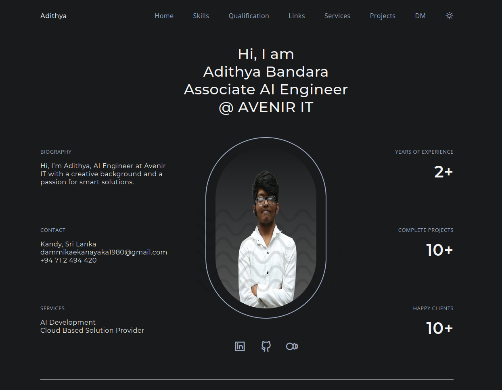

# 深夜 Portfolio Web

<div align="center">
  
  
  <h3>『 デベロッパー・アディティヤ 』</h3>

  [](https://adhidevx369.github.io/portfolio-web/)
  [](https://github.com/adhidevx369/portfolio-web/stargazers)
  [](LICENSE.md)
  [](https://adhidevx369.github.io/portfolio-web/)

  <p>深い技術の世界へようこそ</p>
</div>

## ⚔️ Features

```css
◾ Dark Aesthetic Design
◾ Responsive Layout System
◾ Void/Light Realm Switch
◾ Shadow Animation Effects
◾ Project Archives Display
◾ Combat Skills Matrix
◾ Encrypted Contact Portal
◾ Performance Optimization
◾ SEO Enhancement
```

## 🗡️ Tech Arsenal

<div align="center">

[](https://developer.mozilla.org/en-US/docs/Web/HTML)
[](https://developer.mozilla.org/en-US/docs/Web/CSS)
[](https://developer.mozilla.org/en-US/docs/Web/JavaScript)
[](https://scrollrevealjs.org/)
[](https://swiperjs.com/)

</div>

## 👁️ Portal View

<div align="center">
  
</div>

## ⚡ Summoning Guide

```bash
# Clone the dark realm
git clone https://github.com/adhidevx369/portfolio-web.git

# Enter the void
cd portfolio-web

# Open the portal
# Use live server to maintain the connection
```

## 📜 Grimoire Structure

```bash
portfolio-web/
├── docs/
│   ├── assets/
│   │   ├── css/          # Styling files
│   │   ├── img/          # Images and icons
│   │   └── js/           # JavaScript files
│   ├── index.html        # Main HTML file
│   └── service-worker.js # PWA service worker
├── LICENSE.md
└── README.md
```

## 🔮 Customization

1. **Personal Information:**
   - Edit `index.html` to update your personal information
   - Modify the content in each section to match your details

2. **Styling:**
   - Customize colors in `docs/assets/css/styles.css`
   - Adjust layouts and responsive breakpoints

3. **Projects:**
   - Add your projects in the projects section of `index.html`
   - Update project images in `docs/assets/img/`

## ⚔️ Join the Legion

Contributions are welcome! Feel free to:

1. Fork the repository
2. Create a new branch (`git checkout -b feature/improvement`)
3. Commit your changes (`git commit -m 'Add some improvement'`)
4. Push to the branch (`git push origin feature/improvement`)
5. Open a Pull Request

## 📖 Scroll of License

This project is licensed under the MIT License - see the [LICENSE.md](LICENSE.md) file for details.

## ⭐ Dark Sign

Leave your mark in the void. Each star strengthens the connection.
闇の中で輝く

---

<div align="center">
  <strong>Forged in Darkness by Adithya</strong>
  <br>
  <sub>until next encounter... 影の世界で会いましょう</sub>
</div>

